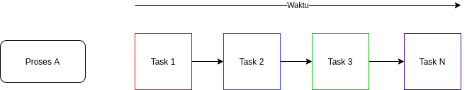
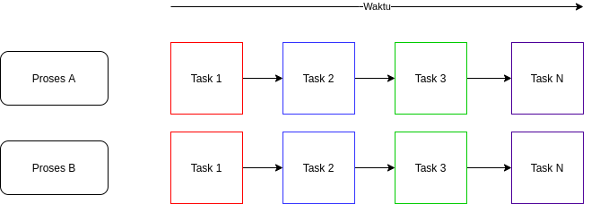

Dalam dunia programming, setiap developer pasti akan membuat aplikasi yang dapat berjalan secara concurrent dan parallel. Salah satu contohnya yaitu sebuah web application. Web application merupakan salah satu contoh dari penerapan concurrent dan parallel, hal ini dapat dilihat jika web application tersebut dapat melakukan processing untuk setiap pengguna yang berbeda. Proses concurrent dan parallel biasa nya digunakan secara bersamaan untuk mendapatkan hasil terbaik dan efisien. Pada zaman sekarang, semua bahasa pemrograman sudah mendukung proses yang berjalan secara concurrent dan parallel, contohnya seperti bahasa pemrograman java, golang, php dan lain sebagainya.

## Apa Itu Concurrent ?

>>Concurrent adalah sebuah proses yang dijalankan secara sekaligus atau sebuah proses yang dapat melakukan beberapa hal secara sekaligus

Dari pengertian diatas dapat diartikan bahwa concurrent tidak dijalankan secara bersamaan akan tetapi dilakukan secara sekaligus. Contoh di dalam kehidupan nyata adalah ketika seseorang bersepeda, lalu tali sepatu nya terlepas maka orang tersebut memperbaiki tali sepatu kemudian bersepeda kembali. Pada contoh diatas, terdapat 2 pengerjaan yaitu bersepeda dan memperbaiki tali sepatu, dimana pengerjaan diatas dapat dilakukan secara sekaligus tetapi tidak dilakukan secara parallel. Berikut merupakan gambar concurrent.

## Apa Itu Parallel ?

>>Parallel adalah beberapa proses yang dilakukan secara bersamaan

Parallel dapat melakukan sebuah proses secara bersamaan, contoh nya adalah misal ada 2 orang yang bersepeda, mereka sama - sama melakukan proses yang bersamaan yaitu bersepeda tetapi dengan pengguna yang berbeda. Contoh lain nya adalah misal seseorang sedang bersepeda, ketika dia bersepeda, dia juga mendengarkan musik. Pada kasus yang kedua, orang tersebut melakukan aktifitas bersamaan yaitu bersepeda dan mendengarkan musik. Berikut merupakan gambar parallel.

## Implementasi Concurrent Pada Java Programming

Silahkan buat sebuah file dengan nama `Concurrent.java` lalu sisipkan code berikut


/**
 *
 * @author rizki mufrizal
 */
public class Concurrent {

    static int calculate(int a, int b) {
        return a + b;
    }

    static void print(int result) {
        System.out.println("Result " + result);
    }

    public static void main(String[] args) {
        int a = 1;
        int b = 1;
        int calculate = calculate(a, b);
        print(calculate);
    }
}


Dari contoh diatas, dapat dilihat yang pertama kali dilakukan adalah task calculate angka dari variable a dan variable b, lalu kemudian dijalankan task print. Concurrent juga dapat dilakukan dengan melakukan implementasi multi thread karena pada dasar nya concurrent biasa nya menggunakan single core dengan banyak thread sedangkan pada parallel akan menggunakan multi core processor.

## Implementasi Parallel Pada Java Programming

Silahkan buat sebuah file dengan nama `Parallel.java` lalu sisipkan code berikut


import java.util.stream.IntStream;

/**
 *
 * @author rizki
 */
public class Parallel {

    public static void main(String[] args) {
        System.out.println("Normal Iterasi");
        IntStream iterasiNormal = IntStream.rangeClosed(1, 10);
        System.out.println("Is Parallel : " + iterasiNormal.isParallel());
        iterasiNormal.forEach(i -> System.out.println("Normal Iterasi : " + i));

        System.out.println("Parallel Iterasi");
        IntStream iterasiParallel = IntStream.rangeClosed(1, 10).parallel();
        System.out.println("Is Parallel : " + iterasiParallel.isParallel());
        iterasiParallel.forEach(i -> System.out.println("Parallel Iterasi : " + i));
    }

}


Pada saat code java diatas dijalankan maka akan muncul output seperti berikut


Normal Iterasi
Is Parallel : false
Normal Iterasi : 1
Normal Iterasi : 2
Normal Iterasi : 3
Normal Iterasi : 4
Normal Iterasi : 5
Normal Iterasi : 6
Normal Iterasi : 7
Normal Iterasi : 8
Normal Iterasi : 9
Normal Iterasi : 10

Parallel Iterasi
Is Parallel : true
Parallel Iterasi : 7
Parallel Iterasi : 6
Parallel Iterasi : 8
Parallel Iterasi : 1
Parallel Iterasi : 4
Parallel Iterasi : 2
Parallel Iterasi : 9
Parallel Iterasi : 5
Parallel Iterasi : 10
Parallel Iterasi : 3


Hasil dari percobaan diatas dapat dilihat bahwa jika sebuah proses tidak dilakukan dengan parallel maka iterasi yang dihasilkan adalah iterasi sequence atau berurutan. Pada saat dijalankan secara parallel maka iterasi yang dihasilkan dapat berbagai macam dan tidak sequence atau berurutan. Pada sample code diatas, penulis menggunakan java 8 stream yaitu IntStream, dimana class ini dapat digunakan untuk melakukan proses secara parallel maupun non parallel.