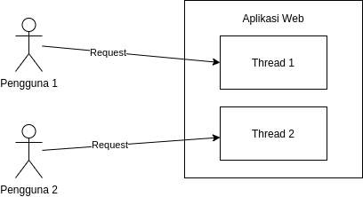
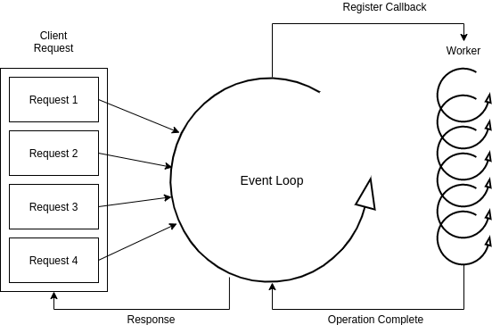

Aplikasi - aplikasi yang telah berjalan pada zaman sekarang biasa nya dibuat dalam bentuk blocking. Contoh yang sangat sederhana adalah aplikasi yang dibangun dengan menggunakan spring webmvc, dimana aplikasi ini masih menggunakan konsep blocking. Sebelum penulis membahas mengenai blocking dan non blocking, maka penulis akan membahas terlebih dahulu mengenai thread dikarenakan blocking dan non blocking sangat berkaitan dengan thread.

## Apa Itu Thread ?

> > Thread adalah rangkain eksekusi dari sebuah aplikasi, biasa nya setiap aplikasi akan memiliki thread, minimal 1 thread.

Contoh yang paling sederhana dapat dilihat dari sebuah aplikasi web. Setiap request yang masuk ke dalam sebuah aplikasi web, maka akan membentuk sebuah koneksi. Koneksi yang dibentuk karena sebuah request akan dijadikan 1 thread pada aplikasi web tersebut. Berikut merupakan sample thread jika diilustrasikan pada sebuah aplikasi web.

Dari gambar diatas, dapat dilihat terdapat request yang masuk secara bersamaan dari pengguna 1 dan pengguna 2. Masing - masing pengguna akan dibuatkan sebuah thread atau istilahnya multithread, dimana masing - masing proses akan dijalankan secara independent sehingga tidak ada proses tunggu menunggu antara kedua request tersebut.

Mungkin ada yang bertanya - tanya, apa perbedaan nya antara multithread dan multicore ? dan apakah dengan komputer single core dapat menggunakan multithread ?. Secara arsitektur, 1 core mempunya beberapa thread, biasanya 1 core memiliki 2 thread. Berikut jika digambarkan arsitektur dari core dan thread.

Jika anda menggunakan linux, kita dapat melakukan pengecekan core dan thread dengan perintah


lscpu


Kemudian lihat pada bagian `Thread(s) per core` yang menandakan jumlah thread per core dan `Core(s) per socket` yang menandakan jumlah core dari processor. berikut contohnya


Architecture: x86_64
CPU op-mode(s): 32-bit, 64-bit
Byte Order: Little Endian
Address sizes: 43 bits physical, 48 bits virtual
CPU(s): 16
On-line CPU(s) list: 0-15
Thread(s) per core: 2
Core(s) per socket: 8
Socket(s): 1
NUMA node(s): 1
Vendor ID: AuthenticAMD
CPU family: 23
Model: 8
Model name: AMD Ryzen 7 2700X Eight-Core Processor


Dari informasi diatas dapat dilihat bahwa cpu nya memiliki 8 core dan setiap core memiliki 2 thread virtual processor sehingga total nya ada 16 thread virtual processor.

### Apa Itu Thread pool Dan Task Queue ?

Setiap menjalankan 1 thread, biasa nya pada komputer dengan arsitektur x64 membutuhkan memory sebanyak 1MB. Bayangkan jika thread tidak di manage dengan baik maka dapat dipastikan resource sebuah komputer akan habis dan aplikasi tersebut tidak dapat berjalan.

> > Thread Pool merupakan sebuah management thread yang dapat digunakan untuk memanage thread dari sebuah aplikasi.

Dengan ada nya thread pool ini, kita dapat mendefinisikan berapa maksimal thread yang akan dibuat, minimal thread, idle dari setiap thread dan lain sebagainya. Jika thread pool nya penuh, bagaimana dengan thread baru selanjutnya ?. Thread baru selanjutnya akan dibuat di dalam sebuah antrian dengan nama task queue.

> > Task Queue berisi thread antrian jika jumlah thread pada thread pool telah penuh.

Task queue atau istilah lain nya yaitu backlog jika disisi http port. Task queue atau backlog juga dapat dibatasi, jika melebihi dari yang ditentukan maka task tersebut tidak akan masuk ke dalam sebuah task queue. Berikut merupakan gambar dari arsitektur thread pool dan task queue.

## Apa Itu Blocking IO ?

> > Blocking IO adalah sebuah proses akan dijalankan jika proses sebelum nya telah selesai dijalankan atau istilah lain nya yaitu synchronous

Blocking IO diadopsi oleh hampir semua web server dan web framework seperti apache tomcat, jetty, dan lain sebagai nya. Blocking IO sendiri mengadopsi teknologi thread pool dan task queue sehingga proses dijalankan jika terdapat thread yang sedang idle atau tidak digunakan. Berikut contoh arsitektur blocking IO jika diimplementasikan ke dalam sebuah web server.

Dari gambar diatas, 1 request yang datang dari client dianggap sebagai sebuah thread, dimana 1 thread ini juga mewakili dari sebuah connection. Backlog pada gambar diatas berfungsi untuk menampung request jika thread yang terdapat pada thread pool sedang penuh atau istilahnya request tersebut akan diantrikan di dalam backlog tersebut. Jika thread yang terdapat pada thread pool tersebut ada yang telah direlease atau dilepas maka request yang terdapat pada backlog akan dimasukkan ke dalam thread pool. Misal maksimal kapasitas thread pool kita setting di angka 500, dan backlog di setting di angka 200. Request yang datang dari client sebanyak 1000 request maka 500 request akan di process secara bersamaan, 200 request akan dimasukkan ke dalam antrian sedangkan 300 request lagi akan di reject karena melebihi kapasitas dari backlog yang telah ditentukan. Dari proses diatas, response server biasa nya terlihat sangat lambat dikarenakan adanya antrian dan harus menunggu proses yang sebelum nya. Contoh framework yang menggunakan blocking IO adalah spring webmvc, ruby on rails, laravel dan lain sebagain nya.

## Apa Itu Non Blocking IO ?

> > Non Blocking IO adalah sebuah proses akan dijalankan tanpa harus menunggu proses lain selesai atau istilah lain nya yaitu asynchronous.

Non blocking IO biasa nya menggunakan teknologi event loop, dimana event loop ini sering disebut sebagai thread bos. Thread bos ini berfungsi sebagai penerima request, dimana jika request tersebut memiliki operasi non blocking IO maka akan langsung di execute oleh thread bos tapi jika memiliki operasi blocking seperti http call, akses ke database maka thread bos akan meneruskan operasi atau task tersebut ke thread worker. Di dalam non blocking IO, thread yang akan digunakan biasa nya sebesar (jumlah virtual processor x 2), dimana thread tersebut nanti nya akan dijadikan sebagai worker thread. Misal nya jika kita memiliki 4 thread virtual processor maka total thread yang akan di buat adalah sebanyak 9 thread terdiri dari 1 thread bos dan 8 thread worker. Berikut contoh arsitektur Non blocking IO jika diimplementasikan ke dalam sebuah web server.

Mengapa Non blocking IO ini dapat berjalan di thread yang kecil ? hal ini disebabkan pada saat dilakukan process blocking semisal kita melakukan http call ke backend, di belakang layar sebenarnya thread tersebut akan melakukan pengiriman http call tersebut dengan bantuan epoll (contoh jika menggunakan linux) dan epoll disini berfungsi untuk menunggu response http call tersebut. Setelah memberikan instruksi kepada epoll, thread tersebut akan di release sehingga thread dapat menjalankan perintah yang lain. Jika response telah diterima, epoll akan melakukan callback atau memberikan informasi kepada worker thread bahwa response telah diterima, lalu worker thread akan mengirimkan response tersebut ke thread bos dan dikembalikan kepada user.

## Kapan Penggunaan Blocking IO Dan Non Blocking IO ?

Blocking IO akan digunakan jika terdapat process yang banyak menggunakan CPU atau lebih dikenal dengan CPU Bound. Contoh dari penggunaan CPU bound seperti perhitungan aritmatika, process encrypt decrypt, dimana process ini tidak cocok jika kita gunakan dengan menggunakan non blocking IO karena CPU bound membutuhkan thread yang banyak untuk pemrosesan yang berat dan jika menggunakan non blocking IO maka aplikasi akan semakin lambat. Berbeda dengan CPU Bound, IO Bound adalah process yang lebih berkaitan dengan IO, baik itu secara network atau secara disk. Contoh IO bound seperti http call yang membutuhkan IO secara network atau membuat koneksi ke database yang membutuhkan IO secara network dan disk. Dari penjelasan diatas, dapat disimpulkan jika aplikasi yang akan kita develop nanti nya banyak menggunakan CPU bound maka gunakanlah blocking IO tapi jika banyak menggunakan IO bound maka gunakanlah non blocking IO.

## Contoh Implementasi Blocking IO Dan Non Blocking IO

Pada artikel ini, penulis akan memberikan contoh implementasi blocking IO dan non blocking IO dengan menggunakan node js. Bagi kamu yang belum tau apa itu node js, silahkan simak artikel [Instalasi Perlengkapan Coding Node JS](https://rizkimufrizal.github.io/instalasi-perlengkapan-coding-node-js/).

### Implementasi Blocking IO

Silkahkan buat sebuah file `data.txt` lalu isi dengan text berikut.


Contoh Blocking IO dan Non Blocking IO dengan menggunakan node js


Lalu buat sebuah file `blocking-io.js` lalu isi dengan codingan berikut


const fs = require('fs');

console.log('start');

const dataFromFile = fs.readFileSync('data.txt');
console.log(dataFromFile.toString());

console.log('End');


Kemudian jalankan dengan perintah `node blocking-io.js` maka akan muncul hasil


start
Contoh Blocking IO dan Non Blocking IO dengan menggunakan node js
End


Dari codingan diatas, penulis menggunakan module fs untuk membaca sebuah file. Dapat dilihat, pada codingan diatas penulis menggunakan fungsi readFileSync, dimana fungsi tersebut berfungsi untuk membaca file dengan metode sync atau blocking IO sehingga proses diatas berjalan secara sequence. Jika proses readFileSync belum selesai maka console.log('End') tidak akan dijalankan sampai proses readFileSync selesai.

### Implementasi Non Blocking IO

Silahkan buat sebuah file `non-blocking-io.js` lalu isi dengan codingan berikut


const fs = require('fs');

console.log('start');

fs.readFile('data.txt', function (error, data) {
if(error) console.log(error);
	console.log(data.toString());
});

console.log('End');


Kemudian jalankan dengan perintah `node non-blocking-io.js` maka akan muncul hasil


start
End
Contoh Blocking IO dan Non Blocking IO dengan menggunakan node js


Dari codingan diatas dapat dilihat perbedaannya yaitu pada non blocking IO, penulis menggunakan fungsi readFile dimana fungsi tersebut berfungsi untuk membaca file dengan metode async atau non blocking IO. Dikarenakan proses read file lama maka proses console.log('End') dijalankan terlebih dahulu pada implementasi non blocking IO. Pada non blocking IO, semua proses akan dijalankan tapi tidak seperti blocking IO dimana proses selanjutnya tidak berpengaruh jika proses sebelum nya masih belum selesai.
