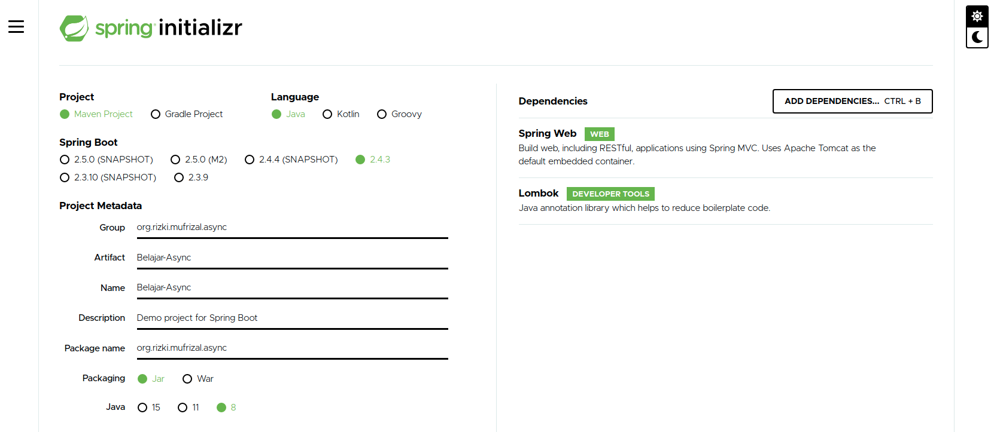

Pada artikel [Blocking IO Dan Non Blocking IO](https://rizkimufrizal.github.io/blocking-io-dan-non-blocking-io/), penulis telah membahas mengenai implementasi non blocking IO pada node js. Pada artikel ini, penulis akan melakukan implementasi non blocking IO dengan menggunakan spring async. Contoh kasus yang penulis gunakan disini adalah melakukan call web service REST API.

>>Spring Async berfungsi untuk membuat suatu proses dijalankan secara asynchronous sehingga suatu proses dapat dijalankan tanpa harus menunggu proses yang lain selesai.

## Setup Project

Silahkan akses [start.spring.io](https://start.spring.io/) untuk melakukan setup project spring. Kemudian silahkan lakukan setup seperti berikut

Lalu buka project tersebut dengan IDE yang anda gunakan misal nya seperti netbeans, eclipse atau Intellij IDEA. Buka file pom.xml lalu tambahkan library `spring-security-oauth2` sehingga konfigurasi pom.xml menjadi


<?xml version="1.0" encoding="UTF-8"?>
<project xmlns="http://maven.apache.org/POM/4.0.0" xmlns:xsi="http://www.w3.org/2001/XMLSchema-instance"
         xsi:schemaLocation="http://maven.apache.org/POM/4.0.0 https://maven.apache.org/xsd/maven-4.0.0.xsd">
    <modelVersion>4.0.0</modelVersion>
    <parent>
        <groupId>org.springframework.boot</groupId>
        <artifactId>spring-boot-starter-parent</artifactId>
        <version>2.4.3</version>
        <relativePath/> <!-- lookup parent from repository -->
    </parent>
    <groupId>org.rizki.mufrizal.async</groupId>
    <artifactId>Belajar-Async</artifactId>
    <version>0.0.1-SNAPSHOT</version>
    <name>Belajar-Async</name>
    <description>Demo project for Spring Boot</description>
    <properties>
        <java.version>1.8</java.version>
    </properties>
    <dependencies>
        <dependency>
            <groupId>org.springframework.boot</groupId>
            <artifactId>spring-boot-starter-web</artifactId>
        </dependency>
        <dependency>
            <groupId>org.springframework.security.oauth</groupId>
            <artifactId>spring-security-oauth2</artifactId>
            <version>2.3.8.RELEASE</version>
        </dependency>
        <dependency>
            <groupId>org.projectlombok</groupId>
            <artifactId>lombok</artifactId>
            <optional>true</optional>
        </dependency>
        <dependency>
            <groupId>org.springframework.boot</groupId>
            <artifactId>spring-boot-starter-test</artifactId>
            <scope>test</scope>
        </dependency>
    </dependencies>

    <build>
        <plugins>
            <plugin>
                <groupId>org.springframework.boot</groupId>
                <artifactId>spring-boot-maven-plugin</artifactId>
                <configuration>
                    <excludes>
                        <exclude>
                            <groupId>org.projectlombok</groupId>
                            <artifactId>lombok</artifactId>
                        </exclude>
                    </excludes>
                </configuration>
            </plugin>
        </plugins>
    </build>

</project>


## Development Project

Pada tulisan ini, penulis akan mencoba melakukan demo spring async dengan cara melakukan call http client. Web service yang akan penulis lakukan adalah sebuah REST API, dimana penulis akan menggunakan service album dan category yang terdapat pada [Developer Spotify](https://developer.spotify.com/documentation/web-api/reference/).

Ubah file `application.properties` menjadi `application.yml` yang terdapat di dalam folder `resources`. Kemudian masukkan konfigurasi berikut


security:
  oauth2:
    client:
      clientId: 1baff7d8d760442184bf7d49acd5477d
      clientSecret: b0c85b1291c64a19bca01cb14907a918
      accessTokenUri: https://accounts.spotify.com/api/token
      grantType: client_credentials

service:
  getAllNewRelease:
    url: https://api.spotify.com/v1/browse/new-releases
  getCategories:
    url: https://api.spotify.com/v1/browse/categories


Key diatas dapat kamu ambil dari halaman [Developer Spotify](https://developer.spotify.com/documentation/web-api/reference/) dengan mengikuti ketentuan prosedur pada web tersebut. Selanjutnya silahkan buat sebuah package `configuration` lalu tambahkan java class `AsyncConfiguration` dengan code seperti berikut


package org.rizki.mufrizal.async.configuration;

import org.springframework.context.annotation.Bean;
import org.springframework.context.annotation.Configuration;
import org.springframework.scheduling.annotation.EnableAsync;
import org.springframework.scheduling.concurrent.ThreadPoolTaskExecutor;

import java.util.concurrent.Executor;

@Configuration
@EnableAsync
public class AsyncConfiguration {

    @Bean(name = "asyncTaskExecutor")
    public Executor asyncTaskExecutor() {
        ThreadPoolTaskExecutor threadPoolTaskExecutor = new ThreadPoolTaskExecutor();
        threadPoolTaskExecutor.setCorePoolSize(3);
        threadPoolTaskExecutor.setMaxPoolSize(3);
        threadPoolTaskExecutor.setQueueCapacity(50);
        threadPoolTaskExecutor.setThreadNamePrefix("async-task-");
        threadPoolTaskExecutor.initialize();
        return threadPoolTaskExecutor;
    }

}


Code diatas berfungsi untuk mendefinisikan bean asyncTaskExecutor, dimana penulis membuat sebuah thread pool dengan prefix `async-task-`, sehingga nanti nya kita dapat menggunakan prefix tersebut untuk memanggil thread pool nya, contoh penggunaan nya yaitu `async-task-test` atau `async-task-sample`.

Untuk mempermudah penggunaan security OAuth2 maka penulis menggunakan `spring-security-oauth2`. Silahkan buat sebuah class java `RestClientConfiguration` di dalam package `configuration` lalu tambahkan code seperti berikut.


package org.rizki.mufrizal.async.configuration;

import org.springframework.beans.factory.annotation.Autowired;
import org.springframework.context.annotation.Bean;
import org.springframework.context.annotation.Configuration;
import org.springframework.core.env.Environment;
import org.springframework.security.oauth2.client.DefaultOAuth2ClientContext;
import org.springframework.security.oauth2.client.OAuth2RestOperations;
import org.springframework.security.oauth2.client.OAuth2RestTemplate;
import org.springframework.security.oauth2.client.resource.OAuth2ProtectedResourceDetails;
import org.springframework.security.oauth2.client.token.DefaultAccessTokenRequest;
import org.springframework.security.oauth2.client.token.grant.client.ClientCredentialsResourceDetails;
import org.springframework.security.oauth2.config.annotation.web.configuration.EnableOAuth2Client;
import org.springframework.web.client.RestTemplate;

@Configuration
@EnableOAuth2Client
public class RestClientConfiguration {

    @Autowired
    private Environment environment;

    @Bean
    public RestTemplate restTemplate() {
        return new RestTemplate();
    }

    @Bean
    protected OAuth2ProtectedResourceDetails oAuth2ProtectedResourceDetails() {
        ClientCredentialsResourceDetails clientCredentialsResourceDetails = new ClientCredentialsResourceDetails();
        clientCredentialsResourceDetails.setClientId(environment.getRequiredProperty("security.oauth2.client.clientId"));
        clientCredentialsResourceDetails.setClientSecret(environment.getRequiredProperty("security.oauth2.client.clientSecret"));
        clientCredentialsResourceDetails.setAccessTokenUri(environment.getRequiredProperty("security.oauth2.client.accessTokenUri"));
        clientCredentialsResourceDetails.setGrantType(environment.getRequiredProperty("security.oauth2.client.grantType"));
        return clientCredentialsResourceDetails;
    }

    @Bean
    public OAuth2RestOperations oAuth2RestOperations() {
        return new OAuth2RestTemplate(oAuth2ProtectedResourceDetails(), new DefaultOAuth2ClientContext(new DefaultAccessTokenRequest()));
    }

}


Pada code diatas, penulis mendefinisikan konfigurasi OAuth2 untuk client, sehingga penulis tidak perlu membuat code untuk memanggil service OAuth2 dikarenakan secara otomatis akan dipanggil oleh `spring-security-oauth2`, ini hanya berlaku jika OAuth2 yang digunakan adalah OAuth2 dengan standard yang sama atau dengan standard secara global.

Selanjutnya penulis membuat class - class mapper untuk dilakukan mapping antara request dan response. Silahkan buat sebuah package `mapper` lalu masukkan code berikut pada java class `ItemMapper`, `ItemCategoryMapper`, `CategoriesMapper`, `CategoryMapper`, `AlbumsMapper` dan `AlbumMapper`.


package org.rizki.mufrizal.async.mapper;

import com.fasterxml.jackson.annotation.JsonIgnoreProperties;
import com.fasterxml.jackson.annotation.JsonProperty;
import lombok.AllArgsConstructor;
import lombok.Data;
import lombok.NoArgsConstructor;

import java.io.Serializable;

@Data
@AllArgsConstructor
@NoArgsConstructor
@JsonIgnoreProperties(ignoreUnknown = true)
public class ItemMapper implements Serializable {

    @JsonProperty("album_type")
    private String albumType;

    @JsonProperty("href")
    private String href;

    @JsonProperty("id")
    private String id;

    @JsonProperty("name")
    private String name;

    @JsonProperty("release_date")
    private String releaseDate;

    @JsonProperty("release_date_precision")
    private String releaseDatePrecision;

    @JsonProperty("total_tracks")
    private Double totalTracks;

    @JsonProperty("type")
    private String type;

    @JsonProperty("uri")
    private String uri;

}



package org.rizki.mufrizal.async.mapper;

import com.fasterxml.jackson.annotation.JsonIgnoreProperties;
import com.fasterxml.jackson.annotation.JsonProperty;
import lombok.AllArgsConstructor;
import lombok.Data;
import lombok.NoArgsConstructor;

import java.io.Serializable;

@Data
@AllArgsConstructor
@NoArgsConstructor
@JsonIgnoreProperties(ignoreUnknown = true)
public class ItemCategoryMapper implements Serializable {

    @JsonProperty("href")
    private String href;

    @JsonProperty("id")
    private String id;

    @JsonProperty("name")
    private String name;

}



package org.rizki.mufrizal.async.mapper;

import com.fasterxml.jackson.annotation.JsonIgnoreProperties;
import com.fasterxml.jackson.annotation.JsonProperty;
import lombok.AllArgsConstructor;
import lombok.Data;
import lombok.NoArgsConstructor;

import java.io.Serializable;
import java.util.List;

@Data
@AllArgsConstructor
@NoArgsConstructor
@JsonIgnoreProperties(ignoreUnknown = true)
public class CategoriesMapper implements Serializable {

    @JsonProperty("href")
    public String href;

    @JsonProperty("items")
    public List<ItemCategoryMapper> items;

    @JsonProperty("limit")
    public Double limit;

    @JsonProperty("next")
    public String next;

    @JsonProperty("offset")
    public String offset;

    @JsonProperty("previous")
    public String previous;

    @JsonProperty("total")
    public Double total;

}



package org.rizki.mufrizal.async.mapper;

import com.fasterxml.jackson.annotation.JsonIgnoreProperties;
import com.fasterxml.jackson.annotation.JsonProperty;
import lombok.AllArgsConstructor;
import lombok.Data;
import lombok.NoArgsConstructor;

import java.io.Serializable;

@Data
@AllArgsConstructor
@NoArgsConstructor
@JsonIgnoreProperties(ignoreUnknown = true)
public class CategoryMapper implements Serializable {

    @JsonProperty("categories")
    public CategoriesMapper categoriesMapper;

}



package org.rizki.mufrizal.async.mapper;

import com.fasterxml.jackson.annotation.JsonIgnoreProperties;
import com.fasterxml.jackson.annotation.JsonProperty;
import lombok.AllArgsConstructor;
import lombok.Data;
import lombok.NoArgsConstructor;

import java.io.Serializable;
import java.util.List;

@Data
@AllArgsConstructor
@NoArgsConstructor
@JsonIgnoreProperties(ignoreUnknown = true)
public class AlbumsMapper implements Serializable {

    @JsonProperty("href")
    private String href;

    @JsonProperty("items")
    private List<ItemMapper> items;

    @JsonProperty("limit")
    private Double limit;

    @JsonProperty("next")
    private String next;

    @JsonProperty("offset")
    private String offset;

    @JsonProperty("previous")
    private String previous;

    @JsonProperty("total")
    private Double total;

}



package org.rizki.mufrizal.async.mapper;

import com.fasterxml.jackson.annotation.JsonIgnoreProperties;
import com.fasterxml.jackson.annotation.JsonProperty;
import lombok.AllArgsConstructor;
import lombok.Data;
import lombok.NoArgsConstructor;

import java.io.Serializable;

@Data
@AllArgsConstructor
@NoArgsConstructor
@JsonIgnoreProperties(ignoreUnknown = true)
public class AlbumMapper implements Serializable {

    @JsonProperty("albums")
    public AlbumsMapper albums;

}


Code - code diatas secara otomatis akan dibuatkan getter setter dengan bantuan `lombok`. Lalu selanjutnya kita akan masuk ke pembahasan spring async nya. Silahkan buat sebuah package `httpclient` lalu tambahkan sebuah class java `SyncHttpClient` dan tambahkan code berikut.


package org.rizki.mufrizal.async.httpclient;

import lombok.extern.slf4j.Slf4j;
import org.rizki.mufrizal.async.mapper.AlbumMapper;
import org.rizki.mufrizal.async.mapper.CategoryMapper;
import org.springframework.beans.factory.annotation.Autowired;
import org.springframework.core.env.Environment;
import org.springframework.http.HttpEntity;
import org.springframework.http.HttpHeaders;
import org.springframework.http.HttpMethod;
import org.springframework.http.MediaType;
import org.springframework.http.ResponseEntity;
import org.springframework.security.oauth2.client.OAuth2RestOperations;
import org.springframework.stereotype.Service;
import org.springframework.web.client.RestTemplate;

import java.util.concurrent.CompletableFuture;

@Service
@Slf4j
public class SyncHttpClient {

    @Autowired
    private RestTemplate restTemplate;

    @Autowired
    private OAuth2RestOperations oAuth2RestOperations;

    @Autowired
    private Environment environment;

    public CompletableFuture<AlbumMapper> getAlbum() {
        log.info("Start Get Album");

        HttpHeaders httpHeaders = new HttpHeaders();
        httpHeaders.setContentType(MediaType.APPLICATION_JSON);
        httpHeaders.set("Authorization", "Bearer " + oAuth2RestOperations.getAccessToken().getValue());
        HttpEntity<HttpHeaders> entity = new HttpEntity<>(httpHeaders);

        ResponseEntity<AlbumMapper> albumMapperResponseEntity = restTemplate
                .exchange(environment.getRequiredProperty("service.getAllNewRelease.url"), HttpMethod.GET, entity, AlbumMapper.class);
        log.info("End Get Album");
        return CompletableFuture.completedFuture(albumMapperResponseEntity.getBody());
    }

    public CompletableFuture<CategoryMapper> getCategory() {
        log.info("Start Get Category");

        HttpHeaders httpHeaders = new HttpHeaders();
        httpHeaders.setContentType(MediaType.APPLICATION_JSON);
        httpHeaders.set("Authorization", "Bearer " + oAuth2RestOperations.getAccessToken().getValue());
        HttpEntity<HttpHeaders> entity = new HttpEntity<>(httpHeaders);

        ResponseEntity<CategoryMapper> categoryMapperResponseEntity = restTemplate
                .exchange(environment.getRequiredProperty("service.getCategories.url"), HttpMethod.GET, entity, CategoryMapper.class);
        log.info("End Get Category");
        return CompletableFuture.completedFuture(categoryMapperResponseEntity.getBody());
    }

}


Kemudian buat sebuah class `AsyncHttpClient` dan masukkan code berikut


package org.rizki.mufrizal.async.httpclient;

import lombok.extern.slf4j.Slf4j;
import org.rizki.mufrizal.async.mapper.AlbumMapper;
import org.rizki.mufrizal.async.mapper.CategoryMapper;
import org.springframework.beans.factory.annotation.Autowired;
import org.springframework.core.env.Environment;
import org.springframework.http.HttpEntity;
import org.springframework.http.HttpHeaders;
import org.springframework.http.HttpMethod;
import org.springframework.http.MediaType;
import org.springframework.http.ResponseEntity;
import org.springframework.scheduling.annotation.Async;
import org.springframework.security.oauth2.client.OAuth2RestOperations;
import org.springframework.stereotype.Service;
import org.springframework.web.client.RestTemplate;

import java.util.concurrent.CompletableFuture;

@Service
@Slf4j
public class AsyncHttpClient {

    @Autowired
    private RestTemplate restTemplate;

    @Autowired
    private OAuth2RestOperations oAuth2RestOperations;

    @Autowired
    private Environment environment;

    @Async("asyncTaskExecutor")
    public CompletableFuture<AlbumMapper> getAlbum() {
        log.info("Start Get Album");

        HttpHeaders httpHeaders = new HttpHeaders();
        httpHeaders.setContentType(MediaType.APPLICATION_JSON);
        httpHeaders.set("Authorization", "Bearer " + oAuth2RestOperations.getAccessToken().getValue());
        HttpEntity<HttpHeaders> entity = new HttpEntity<>(httpHeaders);

        ResponseEntity<AlbumMapper> albumMapperResponseEntity = restTemplate
                .exchange(environment.getRequiredProperty("service.getAllNewRelease.url"), HttpMethod.GET, entity, AlbumMapper.class);
        log.info("End Get Album");
        return CompletableFuture.completedFuture(albumMapperResponseEntity.getBody());
    }

    @Async("asyncTaskExecutor")
    public CompletableFuture<CategoryMapper> getCategory() {
        log.info("Start Get Category");

        HttpHeaders httpHeaders = new HttpHeaders();
        httpHeaders.setContentType(MediaType.APPLICATION_JSON);
        httpHeaders.set("Authorization", "Bearer " + oAuth2RestOperations.getAccessToken().getValue());
        HttpEntity<HttpHeaders> entity = new HttpEntity<>(httpHeaders);

        ResponseEntity<CategoryMapper> categoryMapperResponseEntity = restTemplate
                .exchange(environment.getRequiredProperty("service.getCategories.url"), HttpMethod.GET, entity, CategoryMapper.class);
        log.info("End Get Category");
        return CompletableFuture.completedFuture(categoryMapperResponseEntity.getBody());
    }

}


Dari kedua code diatas tidak ada perbedaan, hanya terdapat perbedaan yaitu di class `AsyncHttpClient` setiap method nya menggunakan annotation `@Async` dengan nama bean nya `asyncTaskExecutor`. Dari segi code memang sama dan tidak ditemukan perbedaan nya sehingga kita tidak dapat mengetahui apakan proses tersebut dilakukans secara sync atau async.

## Test Async Dan Sync

Pada tulisan ini, penulis akan menggunakan library bawaan spring boot untuk melakukan unit test yaitu `spring-boot-starter-test`. Silahkan buka code `BelajarAsyncApplicationTests` di dalam package `test` lalu tambahkan code berikut


package org.rizki.mufrizal.async;

import com.fasterxml.jackson.core.JsonProcessingException;
import com.fasterxml.jackson.databind.ObjectMapper;
import lombok.extern.slf4j.Slf4j;
import org.junit.jupiter.api.Test;
import org.rizki.mufrizal.async.httpclient.AsyncHttpClient;
import org.rizki.mufrizal.async.httpclient.SyncHttpClient;
import org.rizki.mufrizal.async.mapper.AlbumMapper;
import org.rizki.mufrizal.async.mapper.CategoryMapper;
import org.springframework.beans.factory.annotation.Autowired;
import org.springframework.boot.test.context.SpringBootTest;

import java.util.concurrent.CompletableFuture;
import java.util.concurrent.ExecutionException;

@SpringBootTest
@Slf4j
class BelajarAsyncApplicationTests {

    @Autowired
    private AsyncHttpClient asyncHttpClient;

    @Autowired
    private SyncHttpClient syncHttpClient;

    @Test
    void asyncHttpClientTest() throws ExecutionException, InterruptedException, JsonProcessingException {
        log.info("Start Test Async Test");
        CompletableFuture<AlbumMapper> albumMapperResponseMapperCompletableFuture = asyncHttpClient.getAlbum();
        CompletableFuture<CategoryMapper> categoryMapperCompletableFuture = asyncHttpClient.getCategory();

        log.info("Result Get Album {}", new ObjectMapper().writerWithDefaultPrettyPrinter().writeValueAsString(albumMapperResponseMapperCompletableFuture.get()));
        log.info("Result Get Category {}", new ObjectMapper().writerWithDefaultPrettyPrinter().writeValueAsString(categoryMapperCompletableFuture.get()));
        log.info("End Test Async Test");
    }

    @Test
    void syncHttpClientTest() throws ExecutionException, InterruptedException, JsonProcessingException {
        log.info("Start Test Sync Test");
        CompletableFuture<AlbumMapper> albumMapperResponseMapperCompletableFuture = syncHttpClient.getAlbum();
        CompletableFuture<CategoryMapper> categoryMapperCompletableFuture = syncHttpClient.getCategory();

        log.info("Result Get Album {}", new ObjectMapper().writerWithDefaultPrettyPrinter().writeValueAsString(albumMapperResponseMapperCompletableFuture.get()));
        log.info("Result Get Category {}", new ObjectMapper().writerWithDefaultPrettyPrinter().writeValueAsString(categoryMapperCompletableFuture.get()));
        log.info("End Test Sync Test");
    }

}


Kemudian jalankan test nya dengan perintah


mvn clean install


Pada terminal akan muncul log seperti berikut untuk proses async nya


2021-02-22 13:46:33.335  INFO 48219 --- [           main] o.r.m.a.BelajarAsyncApplicationTests     : Start Test Async Test
2021-02-22 13:46:33.349  INFO 48219 --- [   async-task-1] o.r.m.async.httpclient.AsyncHttpClient   : Start Get Album
2021-02-22 13:46:33.349  INFO 48219 --- [   async-task-2] o.r.m.async.httpclient.AsyncHttpClient   : Start Get Category
2021-02-22 13:46:34.003  INFO 48219 --- [   async-task-2] o.r.m.async.httpclient.AsyncHttpClient   : End Get Category
2021-02-22 13:46:34.063  INFO 48219 --- [   async-task-1] o.r.m.async.httpclient.AsyncHttpClient   : End Get Album
2021-02-22 13:46:34.088  INFO 48219 --- [           main] o.r.m.a.BelajarAsyncApplicationTests     : End Test Async Test


sedangkan untuk proses sync nya


2021-02-22 13:46:34.100  INFO 48219 --- [           main] o.r.m.a.BelajarAsyncApplicationTests     : Start Test Sync Test
2021-02-22 13:46:34.101  INFO 48219 --- [           main] o.r.m.async.httpclient.SyncHttpClient    : Start Get Album
2021-02-22 13:46:34.226  INFO 48219 --- [           main] o.r.m.async.httpclient.SyncHttpClient    : End Get Album
2021-02-22 13:46:34.226  INFO 48219 --- [           main] o.r.m.async.httpclient.SyncHttpClient    : Start Get Category
2021-02-22 13:46:34.299  INFO 48219 --- [           main] o.r.m.async.httpclient.SyncHttpClient    : End Get Category
2021-02-22 13:46:34.314  INFO 48219 --- [           main] o.r.m.a.BelajarAsyncApplicationTests     : End Test Sync Test


Dari log diatas dapat dilihat bahwa proses async berjalan dengan menggunakan thread masing - masing, dapat dilihat thread nya yaitu `async-task-1` dan `async-task-2` sedangkan pada proses sync hanya menggunakan thread yang sama yaitu `main` thread. Untuk proses async dapat berjalan secara independent sehingga proses call http client dapat berjalan secara bersamaan, sedangkan pada proses sync, call http client akan dijalankan secara sequence. Untuk source code diatas dapat anda akses di [Belajar-Async](https://github.com/RizkiMufrizal/Belajar-Async). Sekian artikel mengenai belajar spring async jika ada saran dan komentar silahkan isi dibawah dan terima kasih :).