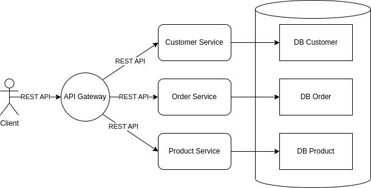

## Apa Itu CQRS ?

>>CQRS adalah kepanjangan dari ommand Query Responsibility Segregation, dimana pattern ini dicetuskan oleh [Greg Young](https://cqrs.files.wordpress.com/2010/11/cqrs_documents.pdf). CQRS merupakah sebuah pattern yang menjelaskan bagaimana cara memisahkan antara proses menulis (command) dan membaca (query) pada sebuah aplikasi.

Jika kita melihat ke berbagai arsitektur microservice, masing - masing service dapat memiliki database nya tersendiri atau lebih sering disebut dengan [database per service](https://microservices.io/patterns/data/database-per-service.html). Pembagian database per service juga dibagi ke dalam beberapa jenis yaitu

1. Private-tables-per-service, yaitu semua service menggunakan database yang sama, akan tetapi setiap service hanya dapat mengakses tabel yang telah ditentukan.

2. Schema-per-service, yaitu semua service memiliki database masing-masing akan tetapi database tersebut berada pada satu node database server.

3. Database-server-per-service, yaitu semua service memiliki database masing-masing dan berada pada masing-masing node database server.

Berikut adalah contoh penggunaan database per service dengan menggunakan jenis Schema-per-service.

Dari contoh microservice diatas, jika pengguna ingin mengambil data order history, dimana kita harus menampilkan data order, data customer dan juga data product maka kita perlu melakukan call api terlebih dahulu ke service yang dibutuhkan lalu mengabungkannya, hal ini membutuhkan waktu yang lumayan panjang untuk menunggu response dari masing - masing service terlebih jika service yang dipanggil lebih dari 1.

Untuk menghadapi permasalah tersebut, [Greg Young](https://cqrs.files.wordpress.com/2010/11/cqrs_documents.pdf) memberikan solusi berupa CQRS dimana proses untuk menulis (command) dan membaca (query) data dipisah sehingga service yang digunakan juga akan berbeda antara untuk pemrosesan data terkait create, update dan delete data. Misal seperti gambar arsitektur sebelum nya, maka untuk memunculkan data order history maka kita perlu membuat 1 service lagi khusus untuk menangani data order history tersebut.

Permasalahan lain juga muncul jika kita menggunakan database SQL yaitu para developer akan menambahkan indexing setiap column untuk mempercepat process pencarian data, akan tetapi penambahan indexing akan akan berimpact pada performance penyimpanan data, begitu juga sebalik nya. jika tidak ada indexing justru process pencarian data akan lambat jika data sudah sangat banyak tetapi process penyimpanan data semakin cepat.

Pada service yang bertugas sebagai query pada bagian CQRS juga mempunya database, dimana database pada service ini digunakan sebagai agregator untuk menyimpan data - data dari service yang diperlukan. Misalnya pada gambar arsitektur sebelum nya, maka kita membutuhkan table dan data yang berasal dari database customer dan product yang akan disimpan di database order juga. Perlu diingat bahwa database ini bisa berbeda antara service command dan service query.

## Teknik Sinkronisasi Data

Pada CQRS, database yang digunakan pada service command dan query terpisah secara node nya. Database yang biasa digunakan pada service query adalah database yang dikhususkan untuk pencarian data secara cepat, contoh nya elasticsearch dan redis. Diperlukan teknik sinkronisasi data dari database pada service query dan service command sehingga data pada database service query selalu up to date. Ada 2 teknik untuk melakukan sinkronisasi data yaitu.

1. Event base, dimana teknik ini menggunakan message broker sebagai pengiriman data dari service command ke service query. Teknik ini sangat dianjurkan karena process yang dilakukan secara asynchronous sehingga process command tidak terganggu secara performance.

2. Change Data Capture (CDC), teknik ini mencapture atau tracking perubahan data pada sebuah database, jika ada perubahana maka dapat melakukan trigger action lain misal melakukan sinkronisasi ke database lain, bahkan mengirimkan data ke message broker dan rest api.

Pada artikel ini, penulis hanya akan membahas teknik event base dikarenakan teknik ini lebih banyak dipakai, lebih mudah digunakan dan secara processing lebih cepat. Berikut adalah arsitektur baru dengan menggunakan CQRS.

Dari diagram diatas, dapat dilihat bahwa panah yang berwarna biru menunjukkan producer yang berfungsi untuk mengirimkan data ke message broker. Panah yang berwarna coklat berfungsi sebagai consumer. Sehingga flow nya akan berjalan seperti berikut.

1. client melakukan order.
2. request diterima oleh api gateway lalu diconvert menjadi grpc dan dikirimkan ke order command service.
3. order command service melakukan process bisnis, jika berhasil maka data akan dikirim ke message broker secara asynchronous dan mengembalikan response ke api gateway.
4. order query service menerima data baru dari message broker dan menyimpan nya ke database.
5. client melihat order history.
6. request diterima oleh api gateway lalu diconvert menjadi grpc dan dikirimkan ke order query service.
7. order query service mengembalikan data history order.

## Peringatan

Apakah CQRS wajib digunakan di semua yang berkaitan dengan query ? jawaban nya adalah tidak. Penggunaan CQRS lebih diutamakan untuk query yang cukup kompleks, service yang sering diakses oleh customer dan service yang sering dilakukan process pencarian.

Jangan pernah menggunakan scheduler untuk melakukan pooling data dari service - service command, karena ini nanti nya akan sangat berat jika data nya dalam jumlah yang banyak, susah di maintenance dan pasti nya tidak akan mendapatkan data yang up to date.

Sekian artikel mengenai Belajar cqrs, di artikel selanjutnya penulis akan membahas bagaimana cara membuat cqris. Jika ada saran dan komentar silahkan isi dibawah dan terima kasih :).