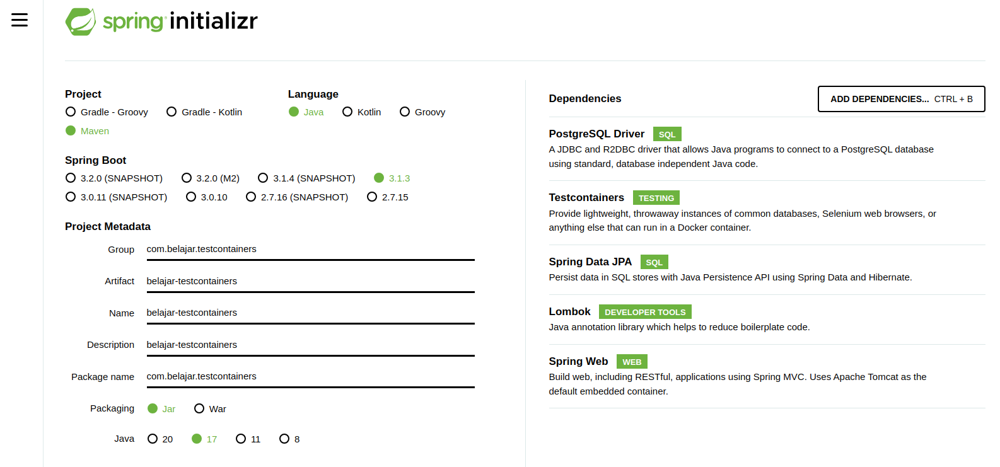

## Apa Itu Testcontainers ?

>>Testcontainers adalah framework yang menyediakan ketersediaan environment dan infrastruktur untuk kebutuhan automate test.

Latar belakang dibuat nya testcontainers adalah untuk mempermudah developer pada saat mejalankan unit test tanpa perlu melakukan setup infrastruktur seperti database, message broker dan lain sebagai nya. Testcontainers nanti nya akan menjalankan kebutuhan inftrastuktur aplikasi yang dibutuhkan dengan menggunakan container (biasa nya menggunakan [docker](https://rizkimufrizal.github.io/belajar-docker/)). Dengan ada nya testcontainers, maka developer dapat fokus pada pembuatan unit test dan integration test. 

Untuk saat ini, testcontainers hanya memiliki module - module tertentu saja sehingga masih terdapat keterbatasan untuk module - module yang tidak common. Contoh module yang dapat kita gunakan adalah seperti database postgresql, mysql, mongodb, kafka dan lain sebagai nya. Tetapi untuk saat ini, module - module yang terdapat pada testcontainers baru di support untuk bahasa pemrograman java, noed js, go dan .NET, berikut [list module - module nya](https://testcontainers.com/modules/).

## Setup Testcontainers Pada Spring Boot

Pada artikel ini, penulis akan mencoba mendemokan dengan menggunakan spring boot. Secara default, spring boot sudah support dengan testcontainers dan juga integration test sehingga dapat mempermudah developer dalam menggunakan module - module testcontainers. Seperti biasa, silahkan buka [spring initializr](https://start.spring.io/). lalu isi seperti berikut



Lalu setelah selesai, silahkan download dan buka dengan IDE. Silahkan buka file pom.xml lalu tambahkan dependecy rest-assured seperti berikut

```xml
<?xml version="1.0" encoding="UTF-8"?>
<project xmlns="http://maven.apache.org/POM/4.0.0" xmlns:xsi="http://www.w3.org/2001/XMLSchema-instance"
         xsi:schemaLocation="http://maven.apache.org/POM/4.0.0 https://maven.apache.org/xsd/maven-4.0.0.xsd">
    <modelVersion>4.0.0</modelVersion>
    <parent>
        <groupId>org.springframework.boot</groupId>
        <artifactId>spring-boot-starter-parent</artifactId>
        <version>3.1.3</version>
        <relativePath/> <!-- lookup parent from repository -->
    </parent>
    <groupId>com.belajar.testcontainers</groupId>
    <artifactId>belajar-testcontainers</artifactId>
    <version>1.0.0</version>
    <name>belajar-testcontainers</name>
    <description>belajar testcontainers</description>
    <properties>
        <java.version>17</java.version>
    </properties>
    <dependencies>
        <dependency>
            <groupId>org.springframework.boot</groupId>
            <artifactId>spring-boot-starter-data-jpa</artifactId>
        </dependency>
        <dependency>
            <groupId>org.springframework.boot</groupId>
            <artifactId>spring-boot-starter-web</artifactId>
        </dependency>

        <dependency>
            <groupId>org.postgresql</groupId>
            <artifactId>postgresql</artifactId>
            <scope>runtime</scope>
        </dependency>
        <dependency>
            <groupId>org.projectlombok</groupId>
            <artifactId>lombok</artifactId>
            <optional>true</optional>
        </dependency>
        <dependency>
            <groupId>org.springframework.boot</groupId>
            <artifactId>spring-boot-starter-test</artifactId>
            <scope>test</scope>
        </dependency>
        <dependency>
            <groupId>org.springframework.boot</groupId>
            <artifactId>spring-boot-testcontainers</artifactId>
            <scope>test</scope>
        </dependency>
        <dependency>
            <groupId>org.testcontainers</groupId>
            <artifactId>junit-jupiter</artifactId>
            <scope>test</scope>
        </dependency>
        <dependency>
            <groupId>org.testcontainers</groupId>
            <artifactId>postgresql</artifactId>
            <scope>test</scope>
        </dependency>
        <dependency>
            <groupId>io.rest-assured</groupId>
            <artifactId>rest-assured</artifactId>
            <scope>test</scope>
        </dependency>
    </dependencies>

    <build>
        <plugins>
            <plugin>
                <groupId>org.springframework.boot</groupId>
                <artifactId>spring-boot-maven-plugin</artifactId>
                <configuration>
                    <excludes>
                        <exclude>
                            <groupId>org.projectlombok</groupId>
                            <artifactId>lombok</artifactId>
                        </exclude>
                    </excludes>
                </configuration>
            </plugin>
        </plugins>
    </build>

</project>
```