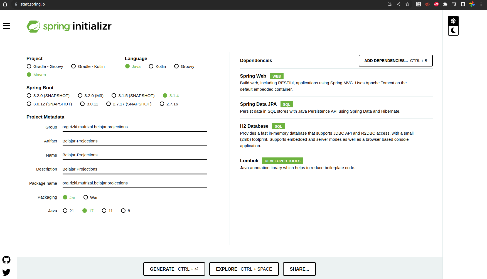

# Apa Itu Projections ?

>>Projections Pada Spring Data JPA adalah salah satu fitur yang ditawarkan oleh spring yang memudahkan developer untuk membuat permodelan dengan tipe tertentu atau biasa nya lebih disebut dengan permodelan dengan custom DTO.

Biasa nya projections akan digunakan ketika developer membutuhkan field - field yang tidak tersedia pada class entity, misal nya seperti hasil dari sum(), avg() dan lain sebagai nya. Projections juga bisa digunakan untuk custom query seperti sub query, dimana hasil dari query tersebut tidak dapat di mapping ke class entity. Projections pada spring data jpa dapat di implementasikan dengan 3 metode yaitu interface projections, class projections (DTO) dan dynamic projections.

Contoh penggunaan projections, misal kita mempunyai sebuah class entity seperti berikut.

```java
public class Product {

    @Id
    private UUID id;

    private String name;

    private BigDecimal price;

    private Integer quantity;
}
```

Dari class entity diatas, misal kita ingin menampilkan nama dan harga product saja. Sebenarnya kita bisa menggunakan class DTO secara manual cuma dibutuhkan proses mapping terlebih dahulu, sehingga dibutuhkan mapping dari class entity ke class DTO. Tapi di case tertentu seperti process sum terhadap suatu column misal jika kita menggunakan entity diatas, maka kita ingin mengetahui berapa total price. Hasil dari sum tersebut tidak mempunyai attribute pada class entity diatas sehingga dibutuhkan proses projections.

## Setup Kebutuhan Belajar Projections

Sebelum memulai case per case projections, kita perlu melakukan setup project untuk kebutuhan belajar projections. Silahkan akses web [spring initializer](https://start.spring.io/), lalu silahkan setup seperti berikut.



Lalu silahkan buka project tersebut dengan menggunakan editor kesayangan anda, lalu silahkan buat 1 class entity `Product` lalu masukkan codingan seperti berikut.

```java
package org.rizki.mufrizal.belajar.projections.domain;

import jakarta.persistence.Entity;
import jakarta.persistence.GeneratedValue;
import jakarta.persistence.Id;
import jakarta.persistence.Table;
import lombok.AllArgsConstructor;
import lombok.Getter;
import lombok.NoArgsConstructor;
import lombok.Setter;
import org.hibernate.annotations.UuidGenerator;

import java.io.Serializable;
import java.math.BigDecimal;
import java.util.UUID;

@Entity
@Table(name = "tb_product")
@AllArgsConstructor
@NoArgsConstructor
@Getter
@Setter
public class Product implements Serializable {

    @Id
    @UuidGenerator(style = UuidGenerator.Style.TIME)
    @GeneratedValue
    private UUID id;

    private String name;

    private BigDecimal price;

    private Integer quantity;
}
```

Lalu silahkan buat 1 class repository yaitu `ProductRepository` dan masukkan codingan berikut

```java
package org.rizki.mufrizal.belajar.projections.repository;

import org.rizki.mufrizal.belajar.projections.domain.Product;
import org.springframework.data.jpa.repository.JpaRepository;

import java.util.UUID;

public interface ProductRepository extends JpaRepository<Product, UUID> {
}
```

Untuk inisialisasi data nya, kita dapat menggunakan annotation `EventListener`, silahkan buka class `BelajarProjectionsApplication` lalu tambahkan code berikut

```java
package org.rizki.mufrizal.belajar.projections;

import org.rizki.mufrizal.belajar.projections.domain.Product;
import org.rizki.mufrizal.belajar.projections.repository.ProductRepository;
import org.springframework.beans.factory.annotation.Autowired;
import org.springframework.boot.SpringApplication;
import org.springframework.boot.autoconfigure.SpringBootApplication;
import org.springframework.boot.context.event.ApplicationReadyEvent;
import org.springframework.context.event.EventListener;

import java.math.BigDecimal;

@SpringBootApplication
public class BelajarProjectionsApplication {

    @Autowired
    private ProductRepository productRepository;

    public static void main(String[] args) {
        SpringApplication.run(BelajarProjectionsApplication.class, args);
    }

    @EventListener
    public void onApplicationEvent(ApplicationReadyEvent event) {
        for (int i = 1; i <= 5; i++) {
            var product = new Product();
            product.setName("Air" + i);
            product.setPrice(BigDecimal.valueOf(1000));
            product.setQuantity(10);

            productRepository.save(product);
        }
    }
}
```

Kemudian untuk config koneksi ke database, silahkan buka file `application.properties` lalu ubah menjadi seperti berikut

```properties
spring.datasource.url=jdbc:h2:mem:belajar_projectios
spring.datasource.driver-class-name=org.h2.Driver
spring.datasource.username=sa
spring.datasource.password=password
spring.jpa.show-sql=true
spring.jpa.properties.hibernate.format_sql=true
spring.jpa.hibernate.ddl-auto=create-drop
```

## Interface Projections

Interface projections merupakan salah satu metode projections yang sangat mudah di implementasikan. Kita cukup membuat sebuah class interface, dimana di dalam class tersebut terdapat method dari masing - masing property yang hendak kita akses.

Pada case pertama, kita akan menggunakan projection untuk mengambil field - field tertentu, misal pada tulisan ini penulis hanya ingin melakukan select untuk nama dan price product saja. Maka yang diperlukan adalah silahkan buat 1 class interface dengan nama `ProductHQL` lalu masukkan codingan berikut.

```java
package org.rizki.mufrizal.belajar.projections.domain.hql;

import java.math.BigDecimal;

public interface ProductHQL {
    String getName();

    BigDecimal getPrice();
}
```

Bisa dilihat dari codingan diatas, untuk dapat melakukan mapping dari hasil query HQL maka diperlukan membuat method getter, dimana kita cukup membuat method untuk field - field yang diperlukan saja. Cara implementasi sangat mudah yaitu cukup menambahka code berikut pada class `ProductRepository`

```java
package org.rizki.mufrizal.belajar.projections.repository;

import org.rizki.mufrizal.belajar.projections.domain.Product;
import org.rizki.mufrizal.belajar.projections.domain.hql.ProductHQL;
import org.springframework.data.jpa.repository.JpaRepository;

import java.util.List;
import java.util.UUID;

public interface ProductRepository extends JpaRepository<Product, UUID> {
    List<ProductHQL> findAllBy();
}
```

Disini dapat dilihat, kita akan mencoba melakukan query ke database tapi hasil nya ingin ditampung ke dalam class interface dimana class interface tersebut hanya berisi 2 field saja. Fungsi projection disini adalah melakukan mapping dari hasil HQL tersebut ke class interface yang memiliki 2 method.

Lalu untuk dapat melakukan test, Silahkan buat 1 class controller yaitu `ProductController` lalu isi code nya seperti berikut.

```java
package org.rizki.mufrizal.belajar.projections.controller;

import org.rizki.mufrizal.belajar.projections.repository.ProductRepository;
import org.springframework.beans.factory.annotation.Autowired;
import org.springframework.http.HttpStatus;
import org.springframework.http.ResponseEntity;
import org.springframework.web.bind.annotation.GetMapping;
import org.springframework.web.bind.annotation.RestController;

@RestController
public class ProductController {

    @Autowired
    private ProductRepository productRepository;

    @GetMapping(value = "/api/product/interface")
    public ResponseEntity<?> productInterface() {
        return new ResponseEntity<>(productRepository.findAllBy(), HttpStatus.OK);
    }

}
```

Setelah selesai, silahkan jalankan command `mvn clean spring-boot:run` untuk menjalankan spring boot nya lalu kamu bisa akses ke browser dengan url `http://localhost:8080/api/product/interface` atau dapat menggunakan curl dengan command

```shell
curl http://localhost:8080/api/product/interface -v
```

Hasil nya berupa

```shell
*   Trying 127.0.0.1:8080...
* Connected to localhost (127.0.0.1) port 8080 (#0)
> GET /api/product/interface HTTP/1.1
> Host: localhost:8080
> User-Agent: curl/7.81.0
> Accept: */*
> 
* Mark bundle as not supporting multiuse
< HTTP/1.1 200 
< Content-Type: application/json
< Transfer-Encoding: chunked
< Date: Thu, 19 Oct 2023 04:25:02 GMT
< 
* Connection #0 to host localhost left intact
[{"name":"Air1","price":1000.00},{"name":"Air2","price":1000.00},{"name":"Air3","price":1000.00},{"name":"Air4","price":1000.00},{"name":"Air5","price":1000.00}]
```

Kemudian klau disisi log spring boot nya, hibernate hanya melakukan select untuk 2 field saja, berikut hasil log sql nya.

```sql
select
    p1_0.name,
    p1_0.price
from
    tb_product p1_0
```

Pertanyaan selanjutnya adalah, apakah projections dengan interface ini dapat dipadukan dengan custom HQL/SQL ? jawaban nya adalah bisa. Silahkan tambahkan code berikut pada class `ProductRepository`

```java
package org.rizki.mufrizal.belajar.projections.repository;

import org.rizki.mufrizal.belajar.projections.domain.Product;
import org.rizki.mufrizal.belajar.projections.domain.hql.ProductHQL;
import org.springframework.data.jpa.repository.JpaRepository;
import org.springframework.data.jpa.repository.Query;

import java.util.List;
import java.util.UUID;

public interface ProductRepository extends JpaRepository<Product, UUID> {
    List<ProductHQL> findAllBy();

    @Query("select p.name as name, p.price as price from Product p")
    List<ProductHQL> findAllCustomQuery();
}
```

Kemudian tambahkan code berikut untuk `ProductController` agar kita dapat melakukan test

```java
package org.rizki.mufrizal.belajar.projections.controller;

import org.rizki.mufrizal.belajar.projections.repository.ProductRepository;
import org.springframework.beans.factory.annotation.Autowired;
import org.springframework.http.HttpStatus;
import org.springframework.http.ResponseEntity;
import org.springframework.web.bind.annotation.GetMapping;
import org.springframework.web.bind.annotation.RestController;

@RestController
public class ProductController {

    @Autowired
    private ProductRepository productRepository;

    @GetMapping(value = "/api/product/interface")
    public ResponseEntity<?> productInterface() {
        return new ResponseEntity<>(productRepository.findAllBy(), HttpStatus.OK);
    }

    @GetMapping(value = "/api/product/interface/query")
    public ResponseEntity<?> productInterfaceQuery() {
        return new ResponseEntity<>(productRepository.findAllCustomQuery(), HttpStatus.OK);
    }

}
```

Kemudian silahkan akses url ke `http://localhost:8080/api/product/interface/query` dengan browser atau curl maka hasil nya akan sama seperti sebelum nya.

## Class-based Projections (DTOs)

Projection selanjutnya yaitu menggunakan class based atau biasa nya sering disebut dengan DTO (Data Transfer Objects). Berbeda dengan interface, class based projections biasa nya akan dilakukan mapping langsung dari hasil query ke class DTO. Pada artikel ini, penulis akan memberikan contoh penggunaan class based projections yaitu dengan melakukan proses sum terhadap column price. Silahkan buat sebuah class dengan nama `ProductPriceHQL` di dalam package `org.rizki.mufrizal.belajar.projections.domain.hql`

```java
package org.rizki.mufrizal.belajar.projections.domain.hql;

import lombok.AllArgsConstructor;
import lombok.Getter;
import lombok.NoArgsConstructor;
import lombok.Setter;

import java.io.Serializable;
import java.math.BigDecimal;

@Getter
@Setter
@AllArgsConstructor
@NoArgsConstructor
public class ProductPriceHQL implements Serializable {
    private BigDecimal price;
}
```

Kemudian pada class `ProductRepository` ubah codingan nya seperti berikut

```java
package org.rizki.mufrizal.belajar.projections.repository;

import org.rizki.mufrizal.belajar.projections.domain.Product;
import org.rizki.mufrizal.belajar.projections.domain.hql.ProductHQL;
import org.rizki.mufrizal.belajar.projections.domain.hql.ProductPriceHQL;
import org.springframework.data.jpa.repository.JpaRepository;
import org.springframework.data.jpa.repository.Query;

import java.util.List;
import java.util.UUID;

public interface ProductRepository extends JpaRepository<Product, UUID> {
    List<ProductHQL> findAllBy();

    @Query("select p.name as name, p.price as price from Product p")
    List<ProductHQL> findAllCustomQuery();

    @Query("select new org.rizki.mufrizal.belajar.projections.domain.hql.ProductPriceHQL(sum(p.price)) from Product p")
    ProductPriceHQL getAllPrice();
}
```

Dapat dilihat pada method `getAllPrice()`, kita menggunakan query HQL/JPQL dan dapat langsung melakukan mapping dari hasil sum price, akan tetapi proses query seperti ini memiliki kekurangan jika terdapat sub query pada parent query nya dan hanya bisa menggunakan HQL/JPQL sehingga tidak memungkinkan jika kita menggunakan native query. Selanjutnya silahkan ubah codingan pada class `ProductController` seperti berikut.

```java
package org.rizki.mufrizal.belajar.projections.controller;

import org.rizki.mufrizal.belajar.projections.repository.ProductRepository;
import org.springframework.beans.factory.annotation.Autowired;
import org.springframework.http.HttpStatus;
import org.springframework.http.ResponseEntity;
import org.springframework.web.bind.annotation.GetMapping;
import org.springframework.web.bind.annotation.RestController;

@RestController
public class ProductController {

    @Autowired
    private ProductRepository productRepository;

    @GetMapping(value = "/api/product/interface")
    public ResponseEntity<?> productInterface() {
        return new ResponseEntity<>(productRepository.findAllBy(), HttpStatus.OK);
    }

    @GetMapping(value = "/api/product/interface/query")
    public ResponseEntity<?> productInterfaceQuery() {
        return new ResponseEntity<>(productRepository.findAllCustomQuery(), HttpStatus.OK);
    }

    @GetMapping(value = "/api/product/dto/query")
    public ResponseEntity<?> productDtoQuery() {
        return new ResponseEntity<>(productRepository.getAllPrice(), HttpStatus.OK);
    }

}
```

Lalu jalankan kembali spring boot nya dan silahkan jalankan command berikut untuk mengakses api tersebut.

```shell
curl http://localhost:8080/api/product/dto/query -v
```

maka hasil nya

```shell
*   Trying 127.0.0.1:8080...
* Connected to localhost (127.0.0.1) port 8080 (#0)
> GET /api/product/dto/query HTTP/1.1
> Host: localhost:8080
> User-Agent: curl/7.81.0
> Accept: */*
> 
* Mark bundle as not supporting multiuse
< HTTP/1.1 200 
< Content-Type: application/json
< Transfer-Encoding: chunked
< Date: Sat, 04 Nov 2023 03:56:09 GMT
< 
* Connection #0 to host localhost left intact
{"price":5000.00}
```

Kemudian jika di cek disisi query nya maka hibernate akan membuat query seperti berikut

```sql
select
    sum(p1_0.price) 
from
    tb_product p1_0
```

Pertanyaan selanjutnya adalah, apakah memungkinkan class based projections menggunakan native query ? jawaban nya adalah bisa dengan menggunakan bantuan annotation `@NamedNativeQuery` untuk deklarasi query native dan annotation `@SqlResultSetMapping` untuk proses mapping dari hasil native query ke class DTO. Penggunaan annotation `@NamedNativeQuery` dan `@SqlResultSetMapping` diharuskan di class entity atau domain yang telah kita define. Yang pertama kita lakukan adalah membuat query native nya, misalkan kita menggunakan query sederhana untuk mengambil semua data

```sql
select id as id, name as nama, price as harga, quantity as jumlah
from tb_product;
```

Setelah mengetahui hasil query nya, silahkan buat sebuah class `ProductCustomHQL` di dalam package `org.rizki.mufrizal.belajar.projections.domain.hql` dan masukkan codingan berikut

```java
package org.rizki.mufrizal.belajar.projections.domain.hql;

import lombok.AllArgsConstructor;
import lombok.Getter;
import lombok.NoArgsConstructor;
import lombok.Setter;

import java.io.Serializable;
import java.math.BigDecimal;

@Getter
@Setter
@AllArgsConstructor
@NoArgsConstructor
public class ProductCustomHQL implements Serializable {
    private String id;

    private String nama;

    private BigDecimal harga;

    private Integer jumlah;
}
```

Lalu silahkan buka class `Product` di dalam package `org.rizki.mufrizal.belajar.projections.domain` lalu ubah codingan nya seperti berikut

```java
package org.rizki.mufrizal.belajar.projections.domain;

import jakarta.persistence.ColumnResult;
import jakarta.persistence.ConstructorResult;
import jakarta.persistence.Entity;
import jakarta.persistence.GeneratedValue;
import jakarta.persistence.Id;
import jakarta.persistence.NamedNativeQuery;
import jakarta.persistence.SqlResultSetMapping;
import jakarta.persistence.Table;
import lombok.AllArgsConstructor;
import lombok.Getter;
import lombok.NoArgsConstructor;
import lombok.Setter;
import org.hibernate.annotations.UuidGenerator;
import org.rizki.mufrizal.belajar.projections.domain.hql.ProductCustomHQL;

import java.io.Serializable;
import java.math.BigDecimal;
import java.util.UUID;

@Entity
@Table(name = "tb_product")
@NamedNativeQuery(
        name = "findAllProduct",
        query = "select id as id, name as nama, price as harga, quantity as jumlah " +
                "from tb_product",
        resultSetMapping = "ProductCustomHQL"
)
@SqlResultSetMapping(
        name = "ProductCustomHQL",
        classes = @ConstructorResult(
                targetClass = ProductCustomHQL.class,
                columns = {
                        @ColumnResult(name = "id", type = String.class),
                        @ColumnResult(name = "nama", type = String.class),
                        @ColumnResult(name = "harga", type = BigDecimal.class),
                        @ColumnResult(name = "jumlah", type = Integer.class)
                }
        )
)
@AllArgsConstructor
@NoArgsConstructor
@Getter
@Setter
public class Product implements Serializable {

    @Id
    @UuidGenerator(style = UuidGenerator.Style.TIME)
    @GeneratedValue
    private UUID id;

    private String name;

    private BigDecimal price;

    private Integer quantity;
}
```

Dari codingan diatas, dapat dilihat pada annotation `@SqlResultSetMapping` kita mendefinisikan nama dari result nya yang nanti dapat di panggil di annotation `@NamedNativeQuery`. Kemudian kita juga dapat melihat ada proses mapping dengan target class dan masing - masing nama column nya. Sedangkan pada annotation `@NamedNativeQuery` dapat kita lihat terdapat nama dari native query kemudian kita juga mendeklarasikan query dan result set mapping nya. Langkan selanjutnya, kita hanya perlu melakukan pemanggilan nama dari native query pada class repository, silahkan buka class `ProductRepository` lalu ubah codingan nya seperti berikut.

```java
package org.rizki.mufrizal.belajar.projections.repository;

import org.rizki.mufrizal.belajar.projections.domain.Product;
import org.rizki.mufrizal.belajar.projections.domain.hql.ProductCustomHQL;
import org.rizki.mufrizal.belajar.projections.domain.hql.ProductHQL;
import org.rizki.mufrizal.belajar.projections.domain.hql.ProductPriceHQL;
import org.springframework.data.jpa.repository.JpaRepository;
import org.springframework.data.jpa.repository.Query;

import java.util.List;
import java.util.UUID;

public interface ProductRepository extends JpaRepository<Product, UUID> {
    List<ProductHQL> findAllBy();

    @Query("select p.name as name, p.price as price from Product p")
    List<ProductHQL> findAllCustomQuery();

    @Query("select new org.rizki.mufrizal.belajar.projections.domain.hql.ProductPriceHQL(sum(p.price)) from Product p")
    ProductPriceHQL getAllPrice();

    @Query(name = "findAllProduct", nativeQuery = true)
    List<ProductCustomHQL> findAllProduct();
}
```

Dari `findAllProduct` kita dapat melihat bahwa kita cukup memanggil nama native query nya saja lalu hasil nya akan disimpan ke dalam class ProductCustomHQL. Ini merupakan metode yang bisa digunakan pada projection class based dengan native query. Lalu buka class `ProductController` dan ubah codingan nya seperti berikut.

```java
package org.rizki.mufrizal.belajar.projections.controller;

import org.rizki.mufrizal.belajar.projections.repository.ProductRepository;
import org.springframework.beans.factory.annotation.Autowired;
import org.springframework.http.HttpStatus;
import org.springframework.http.ResponseEntity;
import org.springframework.web.bind.annotation.GetMapping;
import org.springframework.web.bind.annotation.RestController;

@RestController
public class ProductController {

    @Autowired
    private ProductRepository productRepository;

    @GetMapping(value = "/api/product/interface")
    public ResponseEntity<?> productInterface() {
        return new ResponseEntity<>(productRepository.findAllBy(), HttpStatus.OK);
    }

    @GetMapping(value = "/api/product/interface/query")
    public ResponseEntity<?> productInterfaceQuery() {
        return new ResponseEntity<>(productRepository.findAllCustomQuery(), HttpStatus.OK);
    }

    @GetMapping(value = "/api/product/dto/query")
    public ResponseEntity<?> productDtoQuery() {
        return new ResponseEntity<>(productRepository.getAllPrice(), HttpStatus.OK);
    }

    @GetMapping(value = "/api/product/dto/custom")
    public ResponseEntity<?> productDtoCustom() {
        return new ResponseEntity<>(productRepository.findAllProduct(), HttpStatus.OK);
    }

}
```

Lalu jalankan kembali spring boot nya dan jalankan perintah berikut untuk melakukan test api nya

```shell
curl http://localhost:8080/api/product/dto/query -v
```

dan hasil nya

```shell
*   Trying 127.0.0.1:8080...
* Connected to localhost (127.0.0.1) port 8080 (#0)
> GET /api/product/dto/custom HTTP/1.1
> Host: localhost:8080
> User-Agent: curl/7.81.0
> Accept: */*
> 
* Mark bundle as not supporting multiuse
< HTTP/1.1 200 
< Content-Type: application/json
< Transfer-Encoding: chunked
< Date: Sat, 04 Nov 2023 04:16:48 GMT
< 
* Connection #0 to host localhost left intact
[{"id":"7f000101-8b98-1c1c-818b-988c204e0000","nama":"Air1","harga":1000.00,"jumlah":10},{"id":"7f000101-8b98-1c1c-818b-988c206e0001","nama":"Air2","harga":1000.00,"jumlah":10},{"id":"7f000101-8b98-1c1c-818b-988c20700002","nama":"Air3","harga":1000.00,"jumlah":10},{"id":"7f000101-8b98-1c1c-818b-988c20710003","nama":"Air4","harga":1000.00,"jumlah":10},{"id":"7f000101-8b98-1c1c-818b-988c20710004","nama":"Air5","harga":1000.00,"jumlah":10}]
```

kalau dilihat dari query yang dijalankan

```sql
select
    id as id,
    name as nama,
    price as harga,
    quantity as jumlah 
from
    tb_product
```

dapat dilihat hibernate menjalankan query native tersebut.

## Dynamic Projections

Dynamic projections biasa nya digunakan untuk melakukan mapping ke banyak class tapi menggunakan query yang sama. Dynamic projections akan memanfaatkan java generic untuk dapat melakukan dynamic mapping. Misal contoh kasus kita hanya ingin mengeluarkan nama dan harga barang saja. Silahkan buat 1 class dengan nama `ProductNamePriceHQL` di package `org.rizki.mufrizal.belajar.projections.domain.hql`

```java
package org.rizki.mufrizal.belajar.projections.domain.hql;

import java.math.BigDecimal;

public interface ProductNamePriceHQL {
    String getName();

    BigDecimal getPrice();
}
```

Lalu pada class `ProductRepository` silahkan ubah menjadi seperti berikut

```java
package org.rizki.mufrizal.belajar.projections.repository;

import org.rizki.mufrizal.belajar.projections.domain.Product;
import org.rizki.mufrizal.belajar.projections.domain.hql.ProductCustomHQL;
import org.rizki.mufrizal.belajar.projections.domain.hql.ProductHQL;
import org.rizki.mufrizal.belajar.projections.domain.hql.ProductPriceHQL;
import org.springframework.data.jpa.repository.JpaRepository;
import org.springframework.data.jpa.repository.Query;

import java.util.Collection;
import java.util.List;
import java.util.UUID;

public interface ProductRepository extends JpaRepository<Product, UUID> {
    List<ProductHQL> findAllBy();

    @Query("select p.name as name, p.price as price from Product p")
    List<ProductHQL> findAllCustomQuery();

    @Query("select new org.rizki.mufrizal.belajar.projections.domain.hql.ProductPriceHQL(sum(p.price)) from Product p")
    ProductPriceHQL getAllPrice();

    @Query(name = "findAllProduct", nativeQuery = true)
    List<ProductCustomHQL> findAllProduct();

    <T> T findByName(String name, Class<T> type);
}
```

bisa dilihat di baris akhir kita menggunakan java generic sehingga kita dapat menggunakan class apa pun untuk melakukan mapping result nya. Lalu silahkan buka class `ProductController` dan ubah seperti berikut.

```java
package org.rizki.mufrizal.belajar.projections.controller;

import org.rizki.mufrizal.belajar.projections.domain.hql.ProductNamePriceHQL;
import org.rizki.mufrizal.belajar.projections.repository.ProductRepository;
import org.springframework.beans.factory.annotation.Autowired;
import org.springframework.http.HttpStatus;
import org.springframework.http.ResponseEntity;
import org.springframework.web.bind.annotation.GetMapping;
import org.springframework.web.bind.annotation.RequestParam;
import org.springframework.web.bind.annotation.RestController;

@RestController
public class ProductController {

    @Autowired
    private ProductRepository productRepository;

    @GetMapping(value = "/api/product/interface")
    public ResponseEntity<?> productInterface() {
        return new ResponseEntity<>(productRepository.findAllBy(), HttpStatus.OK);
    }

    @GetMapping(value = "/api/product/interface/query")
    public ResponseEntity<?> productInterfaceQuery() {
        return new ResponseEntity<>(productRepository.findAllCustomQuery(), HttpStatus.OK);
    }

    @GetMapping(value = "/api/product/dto/query")
    public ResponseEntity<?> productDtoQuery() {
        return new ResponseEntity<>(productRepository.getAllPrice(), HttpStatus.OK);
    }

    @GetMapping(value = "/api/product/dto/custom")
    public ResponseEntity<?> productDtoCustom() {
        return new ResponseEntity<>(productRepository.findAllProduct(), HttpStatus.OK);
    }

    @GetMapping(value = "/api/product/dynamic")
    public ResponseEntity<?> productDynamic(@RequestParam(name = "name") String name) {
        return new ResponseEntity<>(productRepository.findByName(name, ProductNamePriceHQL.class), HttpStatus.OK);
    }

}
```

Jika telah selesai lalu jalankan spring boot kembali dan jalankan perintah berikut

```shell
curl http://localhost:8080/api/product/dynamic\?name\=Air1 -v
```

dan hasil nya

```shell
*   Trying 127.0.0.1:8080...
* Connected to localhost (127.0.0.1) port 8080 (#0)
> GET /api/product/dynamic?name=Air1 HTTP/1.1
> Host: localhost:8080
> User-Agent: curl/7.81.0
> Accept: */*
> 
* Mark bundle as not supporting multiuse
< HTTP/1.1 200 
< Content-Type: application/json
< Transfer-Encoding: chunked
< Date: Sat, 04 Nov 2023 05:22:57 GMT
< 
* Connection #0 to host localhost left intact
{"name":"Air1","price":1000.00}
```

dari query HQL nya akan muncul seperti berikut

```sql
select
    p1_0.name,
    p1_0.price 
from
    tb_product p1_0 
where
    p1_0.name=?
```

Dari penjelasan diatas, dapat disimpulkan spring data JPA dapat menggunakan projections dengan 3 metode projections yaitu interace, class based (DTO) dan dynamic. Masing - masing projections digunakan pada kasus - kasus tertentu seperi custom query, sub query dan lain sebagain nya.

Sekian artikel mengenai Belajar projection pada spring data jpa, untuk source code diatas dapat anda akses di [Belajar-Projections](https://github.com/RizkiMufrizal/Belajar-Projections). Jika ada saran dan komentar silahkan isi dibawah dan terima kasih :).