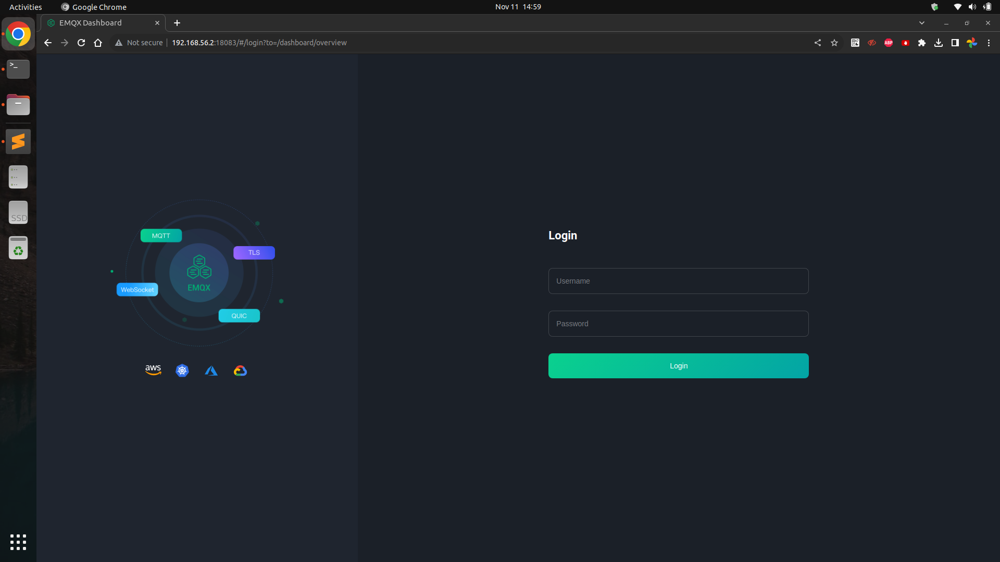
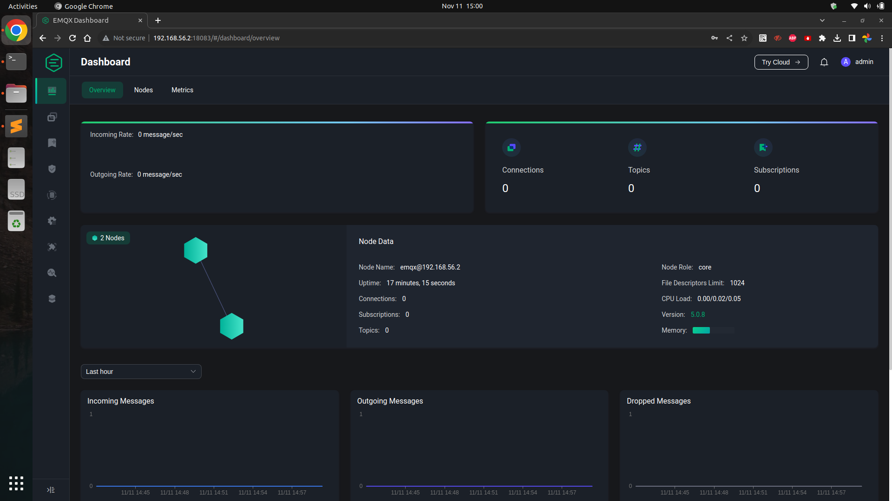
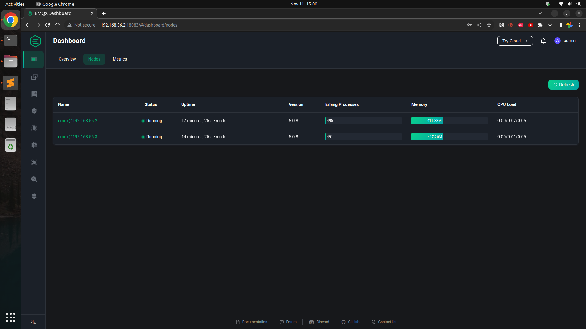

# Apa itu MQTT ?

>>MQTT (Message Queuing Telemetry Transport) merupakah protokol yang digunakan untuk IoT (internet of things). Protokol ini biasanya digunakan untuk komunikasi antar mesin ke mesin, misal nya seperti perangkat arduino, raspi dan lain - lain. Protokol MQTT ini dirancang khusus untuk komunikasi mesin ke mesin dan protokol ini juga berjalan diatas TCP/IP. Berbeda dengan protokol HTTP, protokol MQTT menggunakan mekanisme publish subscribe, dimana penggunaan nya sama seperti message queue seperti Active MQ, Apache Kafka, Rabbit MQ dan lain - lain.

# Apa itu EMQX ?

>>EMQX adalah salah satu broker MQTT yang cukup populer bersifat opensource dan termasuk broker yang banyak menawarkan fitur untuk kebutuhan IoT. EMQX juga menyediakan versi enterprise jika kita membutuhkan fitur - fitur tambahan, misal Enterprise Data Integration (fitur integrasi dengan external database seperti oracle, postgresql dan lain - lain).

## Instalasi EMQX

Pada artikel ini, penulis akan menggunakan 2 buat vm yaitu :

1. VM Node 1 : berfungsi sebagai node master, node master berfungsi untuk primary node nya.
2. VM Node 2 : berfungsi sebagai node worker, dimana node worker akan melakukan join cluster ke node master.

## Requirment Per Node

Adapun kebutuhan untuk per node adalah : 

* Ram 1 GB
* Disk 10 GB
* IP 192.168.50.2 (node 1)
* IP 192.168.50.3 (node 2)
* Centos 7

Untuk memudahkan setup VM per masing - masing node, penulis mencoba menggunakan [vagrant](https://rizkimufrizal.github.io/belajar-vagrant/). Berikut adalah konfigurasi Vagrantfile yang digunakan oleh penulis.


Vagrant.configure("2") do |config|

  config.vm.provider "virtualbox" do |v|
    v.memory = 1024
  end

  config.vm.define "node1" do |node|
    node.vm.box = "centos/7"
    node.vm.hostname = 'node1'
    node.vm.network "private_network", ip: "192.168.56.2"
  end

  config.vm.define "node2" do |node|
    node.vm.box = "centos/7"
    node.vm.hostname = 'node2'
    node.vm.network "private_network", ip: "192.168.56.3"
  end
end


Berikut adalah gambaran arsitektur yang penulis gunakan untuk membuat cluster EMQX.


Lalu jalankan vagrant dengan perintah


vagrant up


Selanjutnya silahkan akses node 1 dengan perintah


vagrant ssh node1


Setalah masuk ke node 1, silahkan jalankan perintah berikut untuk melakukan instalasi


sudo yum update -y && sudo yum install wget -y
sudo mkdir /apps
sudo chown -R vagrant:vagrant /apps/
cd /apps
wget https://www.emqx.com/en/downloads/broker/5.0.8/emqx-5.0.8-el7-amd64.tar.gz
mkdir -p emqx && tar -zxvf emqx-5.0.8-el7-amd64.tar.gz -C emqx


Dan lakukan juga perintah tersebut pada node 2.

## Setup EMQX

Setelah melakukan instalasi EMQX, tahap selanjutnya adalah melakukan setup cluster untuk EMQX. Setup yang dilakukan ada 3 bagian yaitu tunning server, setup node 1 dan setup node 2.

## Tunning Server dan TCP Network

Ada beberapa yang harus dilakukan tunning baik disisi server maupun disisi TCP Network. Berikut adalah tahapan nya

### Tunning kernel linux

tunning ini wajib dilakukan dengan menggunakan user root. Silahkan jalankan perintah berikut


sysctl -w fs.file-max=2097152
sysctl -w fs.nr_open=2097152
echo 2097152 > /proc/sys/fs/nr_open
ulimit -n 1048576


Silahkan buka file `/etc/sysctl.conf` lalu tambahkan code berikut


fs.file-max = 1048576


Kemudian buka file `/etc/systemd/system.conf` dan tambahkan juga code berikut


DefaultLimitNOFILE=1048576


dan yang terakhir silahkan buka file `/etc/security/limits.conf` dan tambahkan code berikut


*      soft    nofile      1048576
*      hard    nofile      1048576


### Tunning TCP Network

Untuk melakukan tunning disisi TCP Network, cukup jalankan perintah berikut


sysctl -w net.core.somaxconn=32768
sysctl -w net.ipv4.tcp_max_syn_backlog=16384
sysctl -w net.core.netdev_max_backlog=16384
sysctl -w net.ipv4.ip_local_port_range='1000 65535'
sysctl -w net.core.rmem_default=262144
sysctl -w net.core.wmem_default=262144
sysctl -w net.core.rmem_max=16777216
sysctl -w net.core.wmem_max=16777216
sysctl -w net.core.optmem_max=16777216
sysctl -w net.ipv4.tcp_rmem='1024 4096 16777216'
sysctl -w net.ipv4.tcp_wmem='1024 4096 16777216'
sysctl -w net.nf_conntrack_max=1000000
sysctl -w net.netfilter.nf_conntrack_max=1000000
sysctl -w net.netfilter.nf_conntrack_tcp_timeout_time_wait=30
sysctl -w net.ipv4.tcp_max_tw_buckets=1048576
sysctl -w net.ipv4.tcp_fin_timeout=15


### Tuning Erlang VM dan EMQX

Untuk tuning erlang VM, silahkan buka file `emqx.conf` di folder `/apps/emqx/etc`, lalu ubah pada bagian node menjadi

```shell
node {
  name = "emqx@192.168.56.3"
  cookie = "emqxcookie"
  data_dir = "data"
  process_limit = 2097152
  max_ports = 2097152
}
```

Sedangkan untuk EMQX, masih di file yang sama, silahkan ubah pada bagian

```shell
listeners.tcp.default {
  bind = "0.0.0.0:1883"
  acceptors = 64
  max_connections = 1024000
}

listeners.ssl.default {
  bind = "0.0.0.0:8883"
  acceptors = 64
  max_connections = 1024000
  ssl_options {
    keyfile = "etc/certs/key.pem"
    certfile = "etc/certs/cert.pem"
    cacertfile = "etc/certs/cacert.pem"
  }
}

listeners.ws.default {
  bind = "0.0.0.0:8083"
  acceptors = 64
  max_connections = 1024000
  websocket.mqtt_path = "/mqtt"
}

listeners.wss.default {
  bind = "0.0.0.0:8084"
  acceptors = 64
  max_connections = 1024000
  websocket.mqtt_path = "/mqtt"
  ssl_options {
    keyfile = "etc/certs/key.pem"
    certfile = "etc/certs/cert.pem"
    cacertfile = "etc/certs/cacert.pem"
  }
}

```

## Setup Node 1

Untuk node 1, silahkan buka file `emqx.conf` di folder `/apps/emqx/etc`. Cari node.name, lalu ubah `emqx@127.0.0.1` menjadi `emqx@<<IP>>` dan juga node.cookie seperti berikut.

```shell
node {
  name = "emqx@192.168.56.2"
  cookie = "emqxcookie"
  data_dir = "data"
}
```

Setelah selesai, silahkan jalankan emqx dengan perintah

```shell
/apps/emqx/bin/emqx start
```

jika sukses maka akan muncul output seperti berikut.

```shell
EMQX 5.0.8 is started successfully!
```

## Setup Node 2

Untuk node 2, sebenarnya sama seperti node 1 yaitu silahkan buka file emqx.conf di folder /apps/emqx/etc. Cari node.name, lalu ubah `emqx@127.0.0.1` menjadi `emqx@<<IP>>` dan juga node.cookie seperti berikut.

```shell
node {
  name = "emqx@192.168.56.3"
  cookie = "emqxcookie"
  data_dir = "data"
}
```

Setelah selesai, silahkan jalankan emqx dengan perintah

```shell
/apps/emqx/bin/emqx start
```

jika sukses maka akan muncul output seperti berikut.

```shell
EMQX 5.0.8 is started successfully!
```

lalu pada node 2 agar dapat join ke cluster, silahkan jalankan perintah berikut.

```shell
/apps/emqx/bin/emqx ctl cluster join emqx@192.168.56.2
```

jika berhasil maka akan muncul output seperti berikut.

```shell
Join the cluster successfully.
Cluster status: #{running_nodes => ['emqx@192.168.56.2','emqx@192.168.56.3'],
                  stopped_nodes => []}
```

atau jika kita ingik melakukan pengecekan statuc cluster dapat menggunakan perintah

```shell
/apps/emqx/bin/emqx ctl cluster status
```

Untuk mengetahui apakah emqx nya sudah berjalan atau tidak, silahkan buka `http://192.168.56.2:18083/` di browser. 18083 merupakan port dari dashboard emqx.



Lalu silahkan login dengan menggunakan user `admin` password `public`. Setelah berhasil login, kita dapat melihat jumlah dari node emqx beserta cluster nya.





Sekian artikel mengenai instalasi dan setup EMQX. Jika ada saran dan komentar silahkan isi dibawah dan terima kasih :).